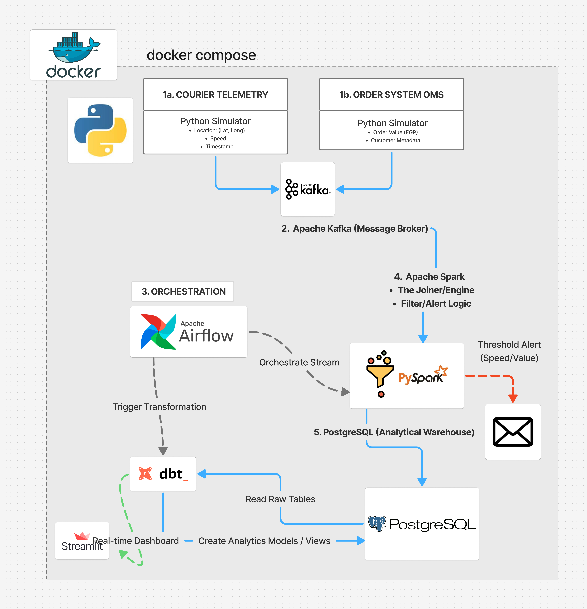

#  Real-Time Logistics Intelligence & Predictive Risk Management
> **An Enterprise-Grade Hybrid Data Pipeline for Fleet Safety, Asset Protection, and Operational Excellence.**

---

##  1. Business Strategy: Why This Project Matters?
In the modern logistics and supply chain industry, a delayed insight is a "dead" insight. This project isn't just about moving data from point A to point B; it’s about **Real-Time Survival**. 

By building this infrastructure, we address three critical business pillars:
* **Asset Protection (High-Value Cargo):** We use "Geospatial Intelligence" to monitor expensive shipments (e.g., Electronics, Pharmaceuticals). If a courier stalls for more than 15 minutes with an order worth > 2000 EGP, the system flags a **Security Breach** immediately.
* **Fleet Safety & Compliance:** Speeding is the #1 cause of cargo damage and accidents. Our system monitors real-time velocity to enforce company safety policies, reducing insurance costs and protecting lives.
* **Customer Trust (SLA Integrity):** By predicting delays before they happen, the business can proactively update customers, turning a potential complaint into a positive touchpoint.

---

## 2. System Architecture Overview
The system follows a **Decoupled Hybrid Architecture** (Lambda-inspired) running entirely within a **Dockerized Ecosystem**. This ensures that the real-time "Hot Path" is never bottlenecked by the analytical "Cold Path."

---

##  3. Technical Deep-Dive (Component Breakdown)

### 🛰️ 3.1. The Data Generation Layer (Simulators)
Instead of static datasets, we use **Microservice Simulators** built in Python:
* **Courier Telemetry Service:** Emulates IoT GPS devices on delivery vehicles, streaming `Latitude`, `Longitude`, `Current_Speed`, and `Direction`.
* **Order Metadata Service:** Simulates the Order Management System (OMS), attaching context like `Order_Value`, `Customer_Priority`, and `Item_Type`.
* **Kafka Integration:** Both simulators act as **Kafka Producers**, pushing JSON payloads to dedicated topics with 99.9% fault tolerance.

### 3.2. The Processing Engine (Apache Spark Streaming)
The heart of the system is **PySpark Structured Streaming**. It performs:
* **In-Memory Joins:** Merges the Telemetry stream with the Order Metadata stream in real-time.
* **Stateful Monitoring:** It doesn't just look at one point; it tracks the "State" of the courier over time to detect patterns (e.g., sustained high speed vs. a sudden stop).
* **Immediate Alerting:** Once a threshold (Speed/Value/Time) is crossed, Spark triggers an external alert action (Email/Notification) **before** the data even hits the database.

### 3.3. Orchestration & Analytics (Airflow, dbt, & Postgres)
* **Apache Airflow:** Acts as the **Watchdog**. It monitors the Spark Streaming job for health and schedules the **dbt** transformation jobs.
* **PostgreSQL (DW):** Serves as our **Analytical Warehouse**. It stores the refined data for long-term historical analysis.
* **dbt (Data Build Tool):** The "Transformation Engine." It runs every hour to turn Raw tables into **Production Models** (e.g., `daily_risk_report`, `courier_efficiency_index`).

---

##  4. Real-Time Logic & Alerting Matrix
The logic implemented in the Spark Engine is what defines the business value:

| Risk Scenario | Trigger Condition | Stakeholder Notified |
| :--- | :--- | :--- |
| **Overspeeding** | `speed > 100 km/h` for > 5 seconds | Fleet Supervisor |
| **Potential Theft** | `speed == 0` & `duration > 15m` & `value > 2000` | Security Team |
| **Route Deviation** | `coordinates` outside of planned `Geofence` | Ops Manager |

---

##  5. Containerization & Networking Strategy
The entire stack is orchestrated via **Docker Compose**, utilizing:
* **Custom Bridge Network:** Enabling service discovery (e.g., Spark finds Kafka by its container name `kafka:9092`).
* **Persistent Volumes:** Ensuring that PostgreSQL data and Kafka logs survive container restarts.
* **Resource Management:** Dedicated CPU/RAM limits for Spark Workers to ensure stable real-time processing.

---

##  6. The Roadmap: Moving to the Cloud
This architecture is **Cloud-Native by Design**. The next steps for production scaling include:
1.  **Ingestion:** Migrating Local Kafka to **AWS MSK** or **Google Pub/Sub**.
2.  **Processing:** Running Spark jobs on **Databricks** or **Amazon EMR**.
3.  **Data Lake:** Storing historical raw data in **Amazon S3** (Parquet format) for future **Machine Learning** (e.g., predicting delivery ETA).
4.  **Warehouse:** Swapping PostgreSQL for **Snowflake** or **Google BigQuery**.

---

##  7. Tech Stack Summary
* **Core Engine:** Apache Spark (Structured Streaming), Apache Kafka.
* **Data Ops:** Apache Airflow, dbt.
* **Languages:** Python (PySpark), SQL.
* **Database:** PostgreSQL.
* **Infrastructure:** Docker, Docker Compose.
* **Visualization:** Power BI Desktop.

---
**Developed with Passion by:** **Rawan Samy Nada** *Senior Information Systems Student | Tanta University* *Specializing in Big Data Engineering & Infrastructure*