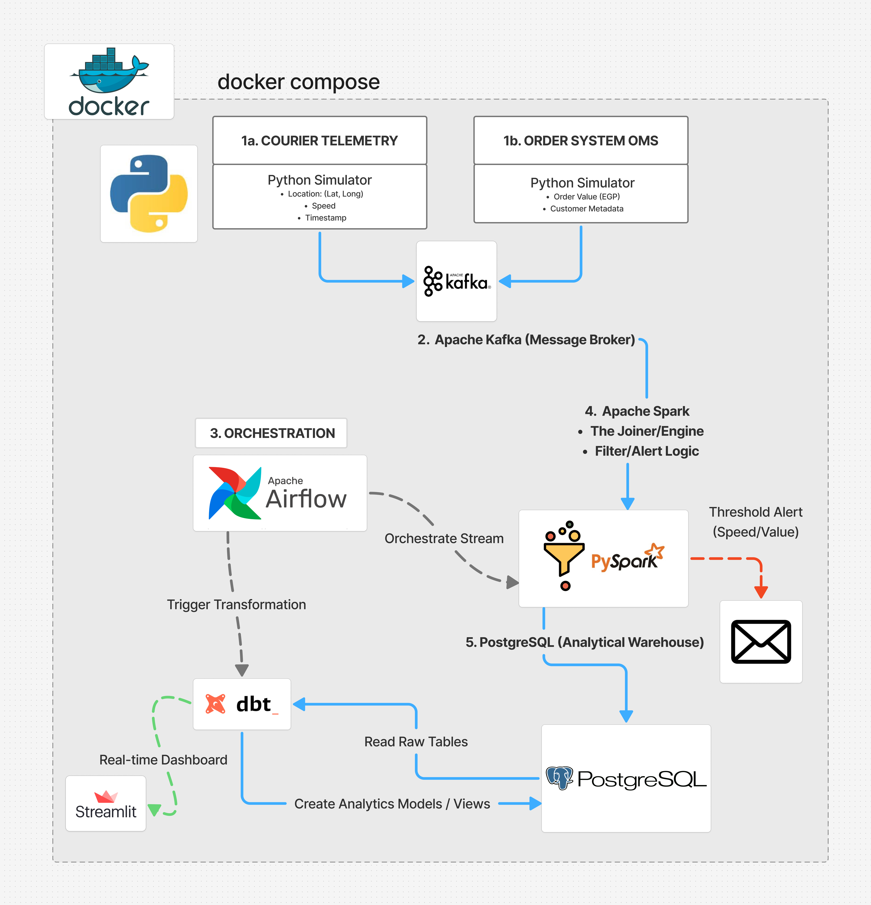

# Real-Time Logistics Intelligence and Predictive Risk Management
> **An Enterprise-Grade Hybrid Data Pipeline for Fleet Safety, Asset Protection, and Operational Excellence.**

---

## 1. Business Strategy: Why This Project Matters?
In the modern logistics and supply chain industry, a delayed insight is ineffective. This infrastructure addresses three critical business pillars:

* **Asset Protection (High-Value Cargo):** Utilizing real-time telemetry to monitor expensive shipments. If a courier carrying high-value orders (exceeding 2000 EGP) is detected overspeeding, the system triggers a "Security Breach" alert immediately.
* **Fleet Safety and Compliance:** Speeding is the leading cause of accidents and cargo damage. This system enforces safety policies in real-time, reducing operational risks and insurance costs.
* **Customer Trust (SLA Integrity):** By detecting potential delays or violations as they happen, the business can proactively manage fleet performance and maintain high service standards.

---

## 2. System Architecture Overview
The architecture implements a **Decoupled Hybrid Pipeline** (Lambda-inspired) orchestrated entirely via Docker. It ensures that the **Hot Path** (Real-time Alerting via Spark) operates independently from the **Cold Path** (Analytical Transformation via dbt).

---

## 3. Technical Deep-Dive

### 3.1. Data Ingestion Layer (Microservice Simulators)
Instead of static datasets, the system uses Python-based microservices to generate live event streams:
* **Courier Telemetry Service:** Emulates IoT/GPS sensors, streaming velocity, and geospatial coordinates.
* **Order Metadata Service:** Simulates Order Management System (OMS) data, attaching financial value and priority to each courier.
* **Apache Kafka:** Acts as the unified message backbone, handling high-throughput ingestion with zero data loss.

### 3.2. Processing Engine (Apache Spark Streaming)
The core logic resides in **PySpark Structured Streaming**:
* **Stream-to-Stream Joins:** Dynamically merges Telemetry and Order streams within a specific watermark window.
* **Real-Time Thresholding:** Filters and detects violations (e.g., Speed > 100 km/h with Value > 2000 EGP) on the fly.
* **Automated Alerting:** Integrated with **SMTP** to dispatch instant email notifications to fleet supervisors.

### 3.3. Orchestration and Analytics (Airflow, dbt, and Postgres)
* **Apache Airflow:** The workflow orchestrator that manages pipeline health and schedules downstream transformations.
* **PostgreSQL:** Serves as the **Analytical Data Warehouse**, storing enriched historical events.
* **dbt (Data Build Tool):** The transformation layer that builds production-ready models, including Risk Categorization and Courier Performance Indices.

---

## 4. Real-Time Logic and Alerting Matrix

| Risk Scenario | Trigger Condition | Business Action |
| :--- | :--- | :--- |
| **Extreme Risk** | Speed > 135 km/h | Immediate Disciplinary Action |
| **High Risk** | Speed 115 - 135 km/h | Automated Warning Email |
| **Moderate Risk** | Speed 90 - 115 km/h | Performance Review |
| **Safe / Top Performer** | Speed < 90 km/h and 0 Violations | Eligibility for Monthly Bonus |

---

## 5. Containerization and Infrastructure
The entire ecosystem is orchestrated via **Docker Compose**:
* **Service Discovery:** Custom bridge networking allows Spark, Kafka, and Postgres to communicate via container names.
* **Data Persistence:** Persistent volumes ensure that logs and database records are preserved across restarts.
* **Scalability:** The stack is designed to be "plug-and-play," allowing for additional Spark workers or Kafka brokers.

---

## 6. Live Monitoring (Streamlit Dashboard)
A custom-built **Streamlit Web UI** provides real-time visibility into fleet operations:
* **Fleet Performance Metrics:** Real-time AVG speed and violation counts.
* **Risk Distribution:** Interactive charts showing the percentage of the fleet in each risk category.
* **Detailed Analytics:** A searchable record of all high-risk events for administrative review.

---

## 7. Cloud Roadmap: Scaling for Production
This architecture is **Cloud-Native by Design**. Future scaling involves:
1. **Ingestion:** Transitioning to **AWS MSK** or **Google Pub/Sub**.
2. **Processing:** Moving Spark workloads to **Databricks** or **Amazon EMR**.
3. **Warehousing:** Migrating PostgreSQL to **Snowflake** or **Google BigQuery** for massive-scale analytics.

---

## 8. Tech Stack Summary
* **Streaming Engine:** Apache Spark (Structured Streaming), Apache Kafka.
* **Orchestration & Transformation:** Apache Airflow, dbt.
* **Languages:** Python (PySpark), SQL.
* **Database:** PostgreSQL.
* **Infrastructure:** Docker, Docker Compose.
* **Frontend:** Streamlit.

---

**Developed by: Rawan Samy Nada**
*Information Systems Student | Tanta University*
*Focus: Data Engineering, Big Data Infrastructure & Real-Time Analytics*